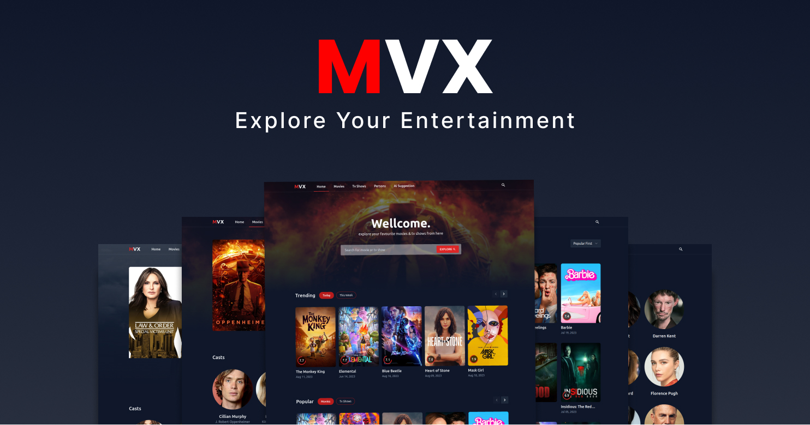

# MVX - Explore Your Entertainment


<br />
MVX is an exciting application designed to help you dive into the world of movies, TV shows, and more. In creating this project, I've been on a learning journey, improving my skills in handling frontend APIs while exploring the power of `rtk-query`. The backbone of MVX is the robust `TMDB API`, which provides a wealth of information to enhance your experience.

**Live Preview**: [https://mvx404.netlify.app/](https://mvx404.netlify.app/)

## What You Can Do with MVX

MVX offers a range of features that promise an immersive and enjoyable exploration of entertainment:

- **Sleek Design**: Enjoy a clean and simple user interface that looks great.
- **Discover Trends**: Stay up-to-date with the latest trends in movies and TV shows.
- **Popular Picks**: Find the most popular movies and TV shows loved by audiences.
- **Personalized Recommendations**: Get suggestions tailored to your tastes.
- **Easy Searching**: Effortlessly search for movies, TV shows, and actors.
- **Detailed Information**: Access in-depth details about movies, TV shows, and actors.

## Technologies We Used

MVX is built using modern technologies to ensure a seamless and engaging experience:

- **React JS**: Powers the dynamic and interactive user interfaces.
- **TypeScript**: Makes development safer and more efficient with improved tooling.
- **TailwindCSS**: Crafts stylish and responsive designs that capture attention.
- **ViteJS**: Speeds up development with an efficient build tool.
- **Redux Toolkit & RTK-Query**: Manages state effortlessly and simplifies API communication.

## Getting Started Is Simple

You can start using MVX in just a few easy steps:

1. **Clone the Project**: First, make a copy of the MVX project on your computer by going to [GitHub Repository Link](https://github.com/tonmoydeb404/mvx).

2. **Install What's Needed**: Open a terminal window, navigate to the project folder, and run this command to install everything required:

   ```
   yarn
   ```

3. **Get an API Key**: To use the `TMDB API`, you need an API key. Go to [TMDB API Documentation](https://developers.themoviedb.org/3/getting-started/introduction) to get yours.

4. **Configure the API Key**: modify file named `.env` in the main project folder. Inside that file, add your API key like this:

   ```
   VITE_APP_TMDB_TOKEN=your_api_key_here
   ```

5. **Start Exploring**: To launch MVX, run the following command in your terminal:

   ```
   yarn dev
   ```

6. **Discover MVX**: Open your web browser and go to `http://localhost:5173` to start exploring the world of entertainment with MVX.

## Reach Out to Developer

If you have any questions, suggestions, or just want to say hi, feel free to get in touch:

- **Email**: tonmoydeb404@gmail.com
- **Portfolio**: [tonmoydeb.com](https://tonmoydeb.com/)
